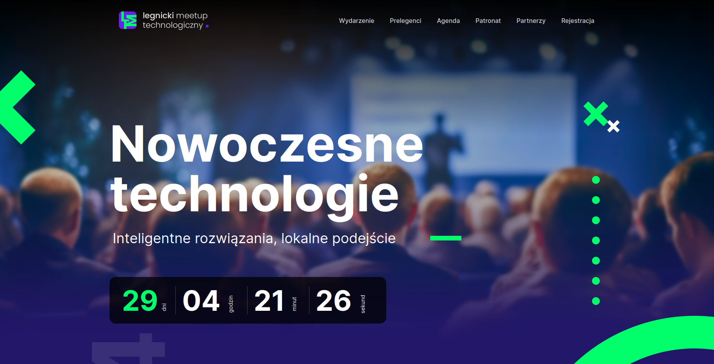

## lmt
### legnicki meetup technologiczny

### Installation

Install PHP dependencies

    composer install

Copy `.env.example` to `.env` and set your environment variables

    cp .env.example .env

### To run in docker environment:
Copy `.env.example` to `.env` and set your environment variables

    cp .env.example .env

- run container:

      make run

- enter the PHP container with `make php`, then install php dependencies
        
      composer install

- The website should be available at `localhost:8051` and `lmt.blumilk.localhost` if we use a Blumilk local traefik proxy

| service           | container name   | default external port |
|-------------------|------------------|-----------------------|
| web               | lmt-dev-nginx    | 8051                  |
| php               | lmt-dev-php      | 8048                  |
| mailhog dashboard | lmt-dev-mailhog  | 8049                  |
| mailhog port      | lmt-dev-mailhog  | 8050                  | 